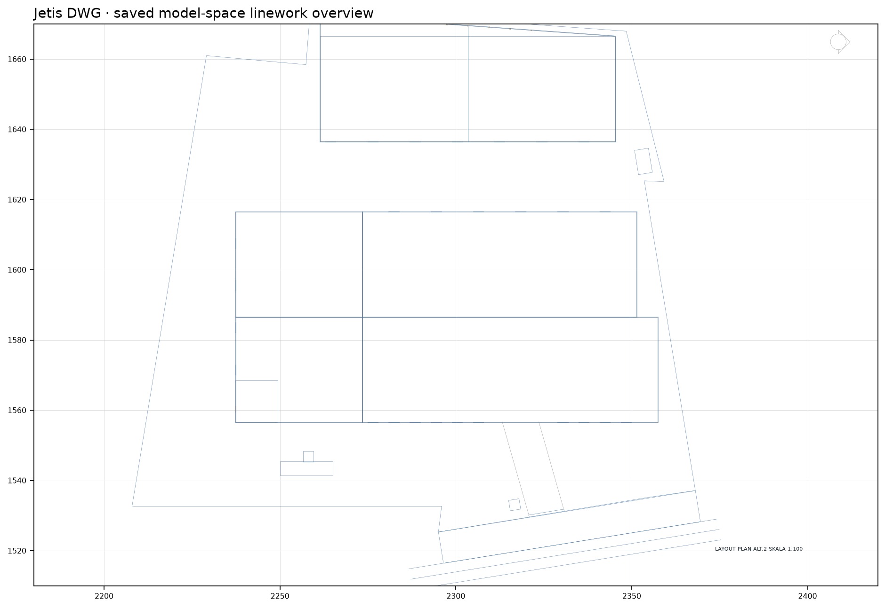

# Pengolahan Hasil Laut Jetis — Astra

Digital twin konseptual yang diturunkan dari `SEND.Pengolahan Hasil Laut - Jetis.dwg`.



## Isi

- `web/dist/` — viewer Three.js, material, navigasi orbit/jelajah, kontrol pintu, pencahayaan siang/senja, dan unduhan SKP.
- `outputs/model.skp` — model SketchUp 2023 native setelah proses build dan read-back selesai.
- `source/input.dwg` — salinan sumber untuk reproduksi; hash-nya dicatat di `project-manifest.json`.
- `analysis/layout-plan.png` — crop layout yang dipakai untuk membaca posisi tapak.
- `scripts/generate_scene.py` — hasilkan scene web dan konfigurasi dari ekstraksi sumber.
- `scripts/audit_scene.py` — cocokkan hash, footprint, satuan, dan data scene.
- `STATE.md` — bukti sumber, keputusan, progres, dan asumsi.

## Ukuran sumber

Header `INSUNITS` DWG kosong. Satuan meter didukung oleh footprint `165A7` sebesar 78×30 m dan `165AA` sebesar 84×30 m yang cocok dengan anotasi Tahap 1 pada gambar. Tapak tahap 2 `1656E` disimpan sebagai poligon 84×36 m sesuai bentuk sumber.

Label potongan menunjukkan eave +9.00 m, ridge +13.50 m, serta profil WF350/WF300 dan CNP125. Detail sambungan, ketebalan profil, fungsi ruang, lini pengolahan, peralatan, dan sebagian bukaan adalah asumsi visual. Model ini bukan dokumen konstruksi atau pemeriksaan struktur.

## Buka viewer lokal

Jalankan server statis dari folder `web/dist`:

```powershell
python -m http.server 8765 --bind 127.0.0.1
```

Buka `http://127.0.0.1:8765/`.

## Publikasi

Workflow GitHub Pages memakai `web/dist` sebagai situs dan memeriksa keberadaan `assets/scene.json` serta `downloads/model.skp` sebelum deploy. URL target: <https://bambssquad.github.io/jetis-digital-twin-astra/>.
