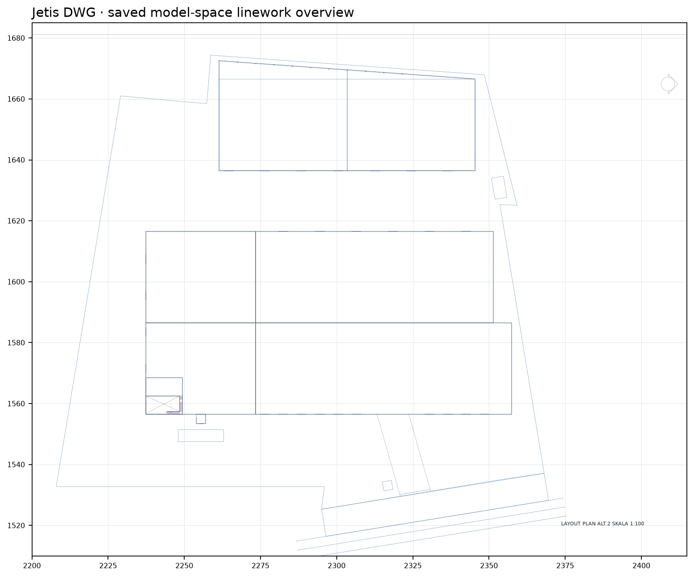
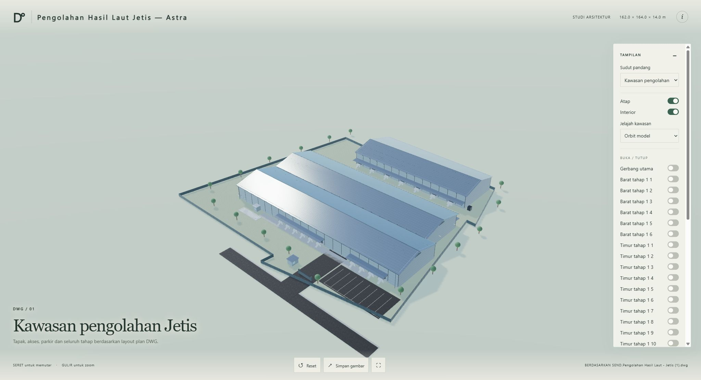

# Pengolahan Hasil Laut Jetis — Astra

Digital twin Astra revisi 02 dari `SEND.Pengolahan Hasil Laut - Jetis (1).dwg`, 30 September 2026. Source, scene web, pemeriksaan dan output SketchUp memakai satu koordinat model dalam meter.



## Isi

- `web/dist/` — viewer Three.js, material, navigasi orbit/jelajah, kontrol pintu, pencahayaan siang/senja, dan unduhan SKP.
- `outputs/model.skp` — model SketchUp 2023 native setelah proses build dan read-back selesai.
- `source/input.dwg` — salinan sumber untuk reproduksi; hash-nya dicatat di `project-manifest.json`.
- `analysis/layout-plan.png` — crop layout yang dipakai untuk membaca posisi tapak.
- `scripts/generate_scene.py` + `scripts/revision_scene.py` — hasilkan scene web dan konfigurasi dari ekstraksi sumber serta kontrak revisi. Elemen tapak yang tidak berubah mempertahankan ID sebelumnya.
- `scripts/audit_scene.py` — cocokkan hash, footprint, atap, ketebalan CNP, posisi anak tangga, void, bukaan, dan data scene dengan kontrak sumber.
- `scripts/check_navigation.mjs` — periksa 57 jalur naik–turun, gerak pintu dalam dua arah sumbu, serta pintu engsel pencatatan.
- `analysis/revisions/2026-09-30/` — salinan sumber revisi, kontrak parameter, analisis independen Astra, dan bukti gambar.
- `STATE.md` — bukti sumber, keputusan, progres, dan asumsi.

## Ukuran sumber

Header `INSUNITS` DWG kosong. Satuan meter didukung footprint `2A310` sebesar 78 × 30 m dan `2A313` sebesar 84 × 30 m, serta bentang potongan 30 + 30 m. Baris bangunan tahap 1 menerus sepanjang 114 m dan 120 m. Tahap 2 `2A2D5` berbentuk trapesium sepanjang 84 m, dengan kedalaman 36 m menjadi 30 m. Atap tahap 2 mengikuti poligon `16817`.

Potongan menetapkan lantai utama ±0 dan lantai dua +4,50 m; tanda +1,00 menunjuk kepala pedestal. Lantai dua mengikuti bentang rangka 120 × 30 m pada potongan A-A/C-C, dengan void dan tangga sumber. Pelat menerus setebal 150 mm adalah asumsi; profil 300 mm pada potongan menunjukkan rangka WF300.

Lereng atap tergambar 15°, nok nominal +13,50 m, penutup galvalume 0,40 mm, dan gording CNP 125 × 50 × 2 mm tiap 1,20 m sepanjang lereng. Angka +9,00 merupakan referensi tumpuan, bukan tinggi semua tepi penutup atap.

Revisi menambahkan jembatan timbang 15 × 4 m, ruang pencatatan 3 × 3 m berdinding 150 mm, jendela 1,50 m, modul tangga 12 × 12 m, 28 anak tangga dan dua bordes. Tiga puluh kenaikan 150 mm ditetapkan sebagai asumsi untuk mencapai +4,50 m.

Bam memilih ambang pintu +1,20 m dengan platform dan akses dalam/luar sebagai asumsi visual yang menyelesaikan perbedaan antara tampak dan potongan. Dua puluh tujuh pintu utama memiliki dua daun dengan ukuran total 3 × 3 m; satu akses personel lebih kecil berukuran 1,80 × 2,20 m. Mekanisme geser pintu industri adalah asumsi. Pintu P90 ruang pencatatan berengsel dan membuka ke dalam sesuai sumber.

Tebal profil WF, sambungan, fondasi, kanopi, mekanisme yang tidak diberi detail, peralatan proses dan lanskap tetap merupakan visualisasi. Model ini bukan dokumen konstruksi atau pemeriksaan struktur. Output SKP revisi dibuat langsung dengan SketchUp C API tanpa MCP; status native dan publikasi dicatat di `STATE.md`.

## Buka viewer lokal

Jalankan server statis dari folder `web/dist`:

```powershell
python -m http.server 8765 --bind 127.0.0.1 --directory web/dist
```

Buka `http://127.0.0.1:8765/`.

Jalankan pemeriksaan lokal dari akar proyek:

```powershell
python scripts/generate_scene.py
python scripts/audit_scene.py
node scripts/check_navigation.mjs
```

## Publikasi

Workflow GitHub Pages memakai `web/dist` sebagai situs dan memeriksa keberadaan `assets/scene.json` serta `downloads/model.skp` sebelum deploy. URL target: <https://bambssquad.github.io/jetis-digital-twin-astra/>.

## Hasil revisi 02

- [Viewer publik](https://bambssquad.github.io/jetis-digital-twin-astra/)
- [Unduh SKP 2023](https://bambssquad.github.io/jetis-digital-twin-astra/downloads/model.skp)
- [Studi sumber, keputusan dan asumsi](analysis/revisions/2026-09-30/source-study.md)
- [Ringkasan pemeriksaan](analysis/revisions/2026-09-30/verification-summary.json)



Native berisi 2.713 elemen, 8 scene kamera dan 9 material bertekstur. Pustaka SketchUp 2023 C API lokal menulis SKP tanpa MCP lalu memuat ulang file untuk membaca ID, batas geometri, properti sumber, skala tekstur dan kamera. Semua solid memiliki dua face pada setiap edge. Buka ulang melalui antarmuka aplikasi tidak dilakukan.

`python scripts/native_sdk.py --project .` membuat SKP; `--audit-only` membaca ulang file yang sudah disimpan. Pustaka SketchUpAPI.dll harus tersedia dari instalasi SketchUp 2023 lokal. DLL tidak disertakan atau dipublikasikan. `scripts/build_native.rb` tetap tersedia sebagai catatan jalur sebelumnya; revisi 02 memakai C API sesuai instruksi Bam.

Mode desktop memuat 12/12 map dan 30 kontrol diuji melalui UI serta matriks render. Emulasi mobile 390×844 memuat tekstur 1K dan joystick menggerakkan karakter; tinggi pose berdiri terbaca 1,70 m. Kinerja bergantung perangkat. Gambar `outputs/model-native.png` berasal dari revisi 01; gambar revisi 02 memakai nama `revision02-*`.

Source verification reads actual leaf polygons and wall apertures from the raw DWG. It covers 27 industrial apertures, 42 main window frames, the source P90 hinge, the recorder window cut, all 28 treads and 2 landings with the L2 connection, WF150 depth, and CNP125×2 spacing.
